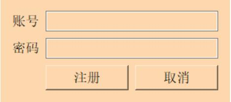
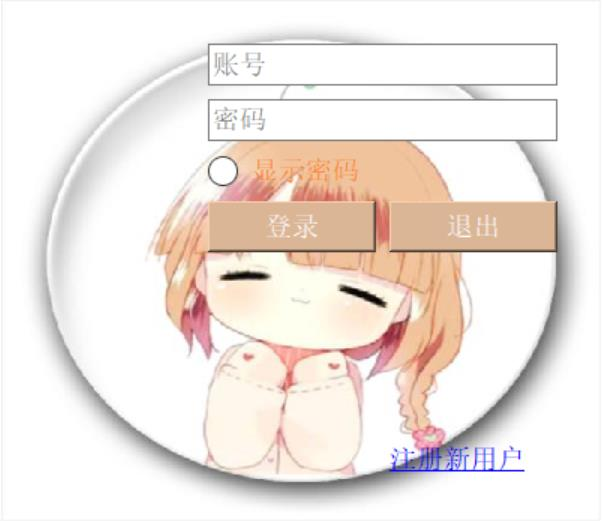
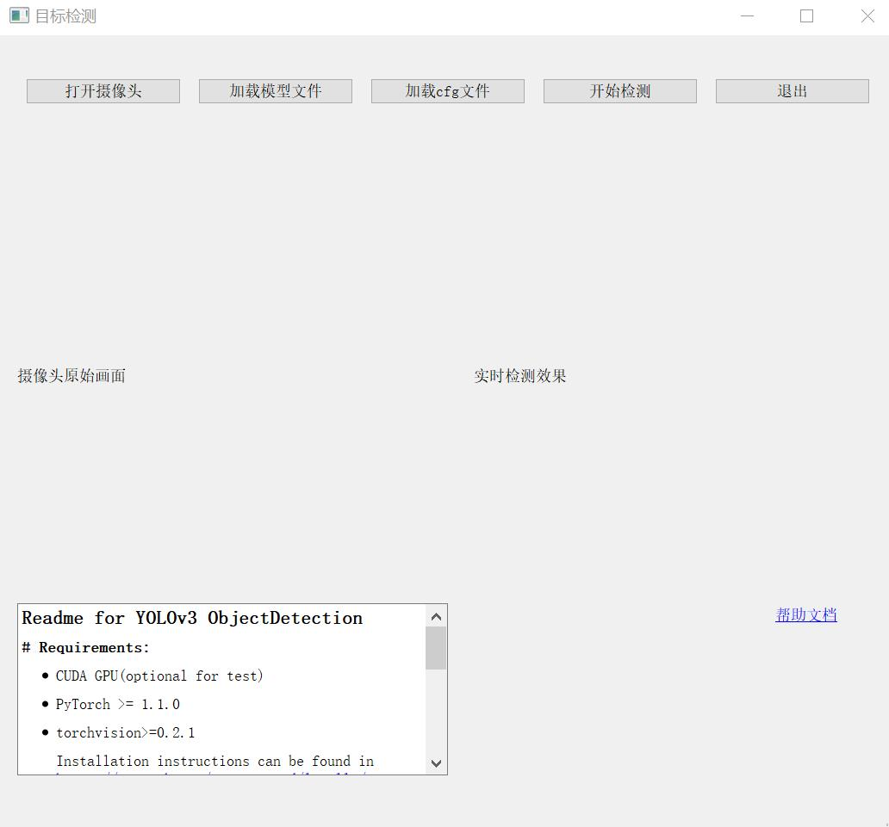

# YOLOv3GUI_Pytorch_PyQt5
This is a GUI project for Deep Learning Object Detection based on YOLOv3 model

#### # Requirements:

- CUDA GPU(optional for test)

- PyTorch >= 1.1.0

- torchvision>=0.2.1

  Installation instructions can be found in https://pytorch.org/get-started/locally/.

- python 3.X

- PyQt5

#### #  Instructions:

`step 1` :  open camera

`step 2` :  load pretrained model (<a>eg, yolov3.weights</a>)

`step 3` :  load configure file (<a>eg, yolov3.cfg</a>)

`step 4` :  detect object

#### #  Results:

```python
python login.py
```

`register`:

 />

`login`:  

 />

`detector`:
 />

#### #Reference:

model: https://github.com/ultralytics/yolov3.git


